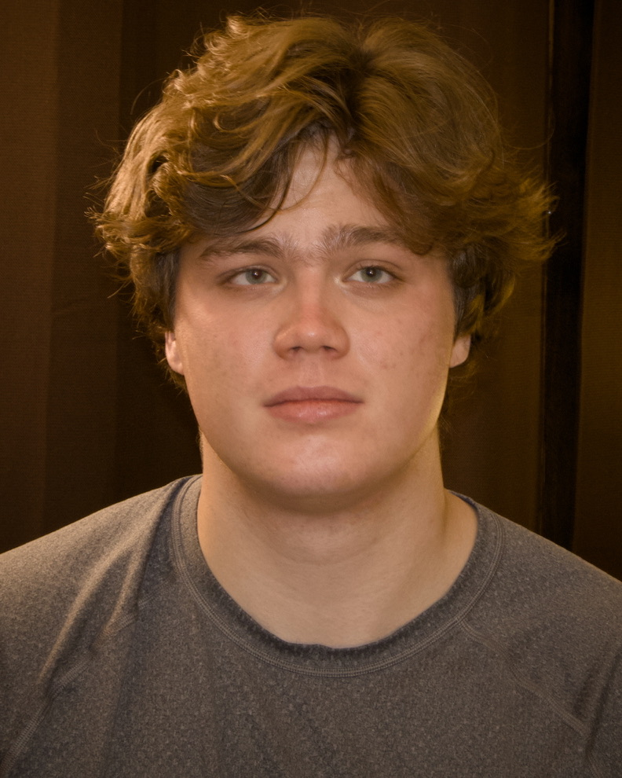

# Contributors

Welcome to DroneWorld! Whether you are a potential user, hopeful contributor, or just snooping around, we are glad you are around!

If you are a new user or contributor, make sure to check out our [Quick Start](readme.md#quick-start-docker).

Also, make sure to [join our Slack](https://join.slack.com/t/oss-slu/shared_invite/zt-3tvve1db9-q0HsB9DPLCdPnZlg9XWNHw) where we do all of our communication.

---

## The Team

<table>
  <tr>
    <td align="center">
       
      <strong>Charlie Wells</strong> 
      <em>Tech Lead</em> 
      <a href="https://github.com/CharlieWells13">@CharlieWells13</a>
    </td>
    <td align="center">
       
      <strong>Ahmed Bektic</strong> 
      <em>Internal Developer</em> 
      <a href="https://github.com/ahmedbektic">@ahmedbektic</a>
    </td>
    <td align="center">
       
      <strong>Henry Barsanti</strong> 
      <em>Internal Developer</em> 
      <a href="https://github.com/Hbarsanti">@Hbarsanti</a>
    </td>
  </tr>
</table>

