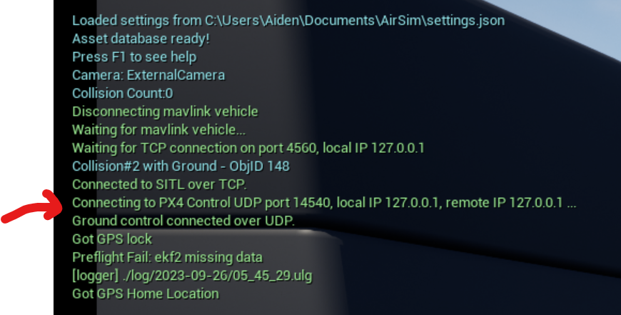

# PX4 AirSim controller

## Requirements
- DRV (parent directory)
- Windows 10/11
- python 3.6+
- cmake 3.16+
- [PX4](https://github.com/PX4/PX4-windows-toolchain/releases)
- [mavsdk server](https://github.com/mavlink/MAVSDK/releases)
- mavsdk python package
- cygwin

## Setup

### 1. Run DRV

1. Edit the `config.json` file to run AirSim in PX4 mode, one drone example is shown below.
```json
{
  "SettingsVersion": 1.2,
  "SimMode": "Multirotor",
  "ViewMode": "SpringArmChase",
  "DefaultVehicleConfig": "PX4",
  "Vehicles": {
    "Drone 1": {
      "VehicleType": "PX4Multirotor",
      "UseSerial": false,
      "LockStep": true,
      "UseTcp": true,
      "TcpPort": 4560,
      "ControlPortLocal": 14540,
      "ControlPortRemote": 14580,
      "Sensors":{
        "Barometer":{
          "SensorType": 1,
          "Enabled": true,
          "PressureFactorSigma": 0.0001825
        }
      },
      "Parameters": {
        "NAV_RCL_ACT": 0,
        "NAV_DLL_ACT": 0,
        "COM_OBL_ACT": 1,
        "LPE_LAT": 47.641468,
        "LPE_LON": -122.140165
      }
    }
  }
}
```
Note that in the parameters section:
```
"ControlPortLocal": 14540,
"ControlPortRemote": 14580,
```
`ControlPortLocal` is the port `PX4` udp connects to.
`ControlPortRemote` is the port that `mavsdk-python` connects to.

2. Run the DRV application and verify that the port numbers are correct. Example:



### 2. PX4
1. Download the msi Windows installer and install PX4 from [here](https://github.com/PX4/PX4-windows-toolchain/releases/download/v0.9/PX4.Windows.Cygwin.Toolchain.0.9.msi)
2. Follow the [instructions](https://docs.px4.io/v1.12/en/dev_setup/dev_env_windows_cygwin.html) and run the PX4 console in cygwin terminal

3. IMPORTANT: Make sure to run the following command to start PX4, instead of the command in the instructions.
```bash
make px4_sitl_default none_iris
```
Verify PX4 is running correctly if you see the following output:
] 

Test that the AirSim drones can takeoff and land by running the following commands in the PX4 console:
```bash
commander takeoff
commander land
```

### 3. Install and run mavsdk server (ignore if you are on Linux)
Ideally, mavsdk server automatically starts when mavsdk-python is imported and called, however Windows does not support this automatically. So we need to manually start the server.

1. Download the mavsdk server binary from [here](https://github.com/mavlink/MAVSDK/releases/download/v1.4.17/mavsdk_server_win32.exe)
2. Run the server, where `-p 50051` is the port number of `mavsdk_server` (default), `udp://:13280` is the px4 drone port to control it. (the ControlRemotePort in the settings.json file).
```PowerShell
.\mavsdk_server_win32 -p 50051 udp://:13280
```

### 4. mavsdk python package
1. Install the mavsdk python package
```bash
pip install mavsdk
```

Finally, test the setup by running `takeoff_and_land.py`

