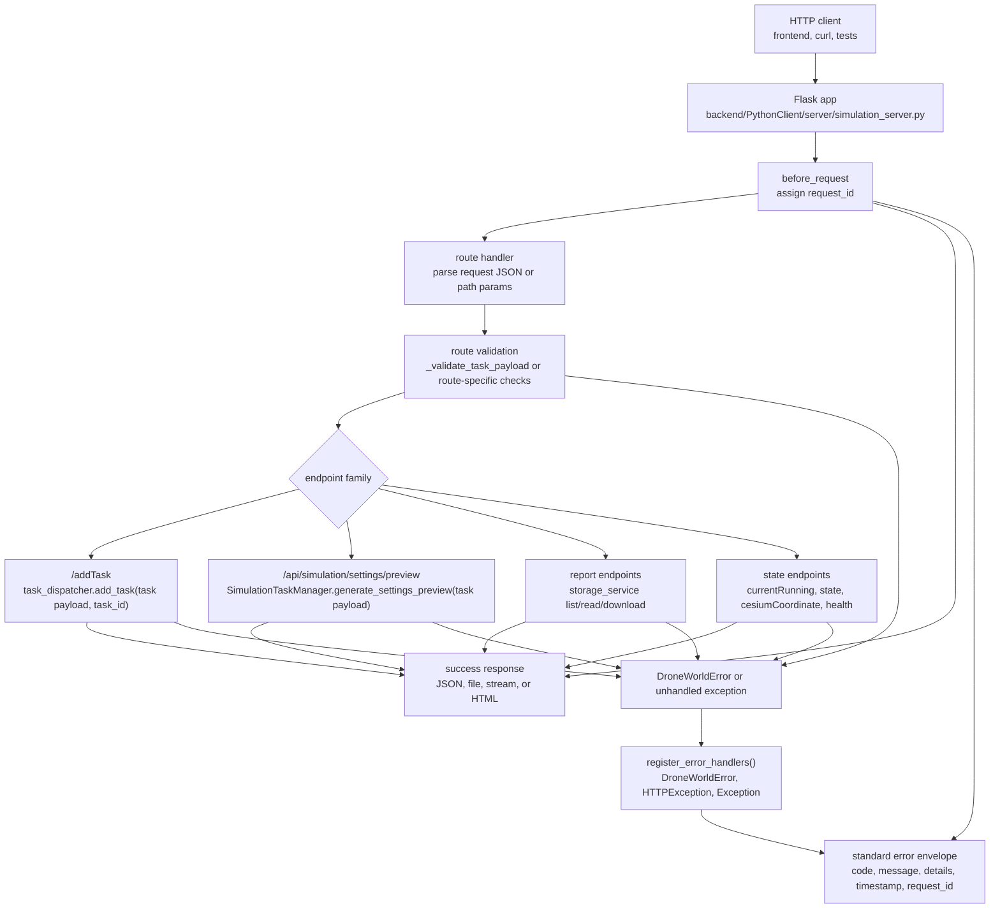
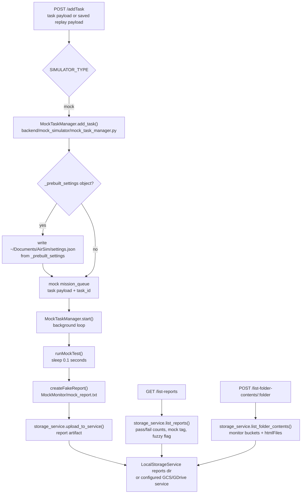
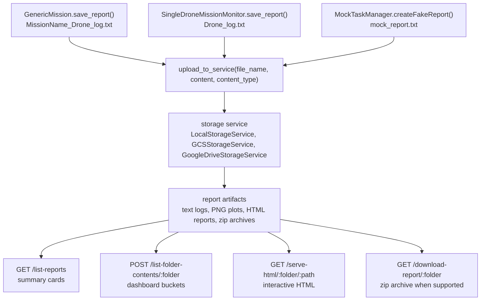

# Backend Data Flow

This page maps how data moves through the Flask backend at runtime. It is meant
for contributors debugging requests, queued simulation tasks, settings
generation, simulator dispatch, monitors, and report storage. It intentionally
uses procedural Mermaid flowcharts instead of duplicating the high-level
architecture image linked from the README.

## How to read these diagrams

- Rectangles are backend modules, functions, files, endpoints, queues, or storage
  artifacts.
- `task payload` means the JSON accepted by `/addTask`: `Drones`, `environment`,
  optional `monitors`, optional `FuzzyTest`, and optional `_prebuilt_settings`.
- `settings.json` is the AirSim/Cosys-AirSim runtime settings file written under
  `~/Documents/AirSim`.
- `cesium.json` is the Cesium origin file written under `~/Documents/AirSim`.
- Backend internals are shown as data and control flow. Frontend state is out of
  scope for this page.

## API request flow

The main API entry point is `backend/PythonClient/server/simulation_server.py`.
At import time it registers CORS, Swagger, error handlers, a task dispatcher, and
a storage service. `SIMULATOR_TYPE=mock` chooses
`backend/mock_simulator/mock_task_manager.py`; every other value chooses
`backend/PythonClient/multirotor/control/simulation_task_manager.py`. The chosen
dispatcher starts immediately in a daemon thread.

Error envelopes are defined in
`backend/PythonClient/server/error_handling.py`. Each response gets an
`X-Request-ID` header, and standardized errors include `code`, `message`,
`details`, `timestamp`, and `request_id`.

Important current risk: `/addTask` calls `_validate_task_payload()`, but then
catches broad `Exception` and re-raises `SimulationFailedError`. That can convert
validation failures into `SIMULATION_FAILED` 500 responses. The preview endpoint
preserves `ValidationError` separately before wrapping other exceptions.

## Real simulator task flow

```mermaid
flowchart TD
  AddTask["POST /addTask<br/>task payload"]
  Validate["validate required sections<br/>Drones, environment, _prebuilt_settings rules"]
  TaskId["create task_id<br/>timestamp_Batch_n"]
  RealDispatcher["SimulationTaskManager.add_task()<br/>queue item: task payload + task_id"]
  Queue["mission_queue<br/>background start() loop"]

  BatchBranch{"FuzzyTest present?"}
  Regular["__run_regular_batch()"]
  Fuzzy["__run_fuzzy_test_batch()<br/>Wind: 0, 7, 14 m/s runs<br/>Speed: range by precision"]

  UpdateSettings["__update_settings(task payload)"]
  PrebuiltBranch{"_prebuilt_settings object?"}
  Prebuilt["__prepare_prebuilt_settings_run()<br/>use saved settings.json<br/>populate runtime missions/monitors"]
  BuildSettings["_build_final_settings_payload()<br/>build settings.json from task payload"]
  DroneMission["populate drones and missions<br/>Vehicles + mission tuples"]
  Wind["__handle_wind_settings()<br/>Direction + Velocity -> X/Y/Z"]
  Monitors["__populate_monitor_list()<br/>enabled monitor tuples"]
  Files["write runtime files<br/>settings.json and cesium.json"]

  Rpc["wait for AirSim RPC<br/>create_multirotor_client() + ping()"]
  Reset["rpc_client.reset()"]
  DynamicImports["dynamic imports<br/>mission and monitor classes"]
  Threads["mission threads + monitor threads<br/>global monitor start/stop threads"]
  AirSimApp["AirSimApplication base<br/>loads settings.json + cesium.json<br/>creates RPC client"]
  StorageUpload["save_report_to_storage()<br/>report artifacts"]
  StorageOptions["configured storage<br/>local reports dir, GCS bucket, or Google Drive folder"]

  AddTask --> Validate --> TaskId --> RealDispatcher --> Queue --> BatchBranch
  BatchBranch -->|no| Regular --> UpdateSettings
  BatchBranch -->|yes| Fuzzy --> UpdateSettings
  UpdateSettings --> PrebuiltBranch
  PrebuiltBranch -->|yes| Prebuilt --> Files
  PrebuiltBranch -->|no| BuildSettings --> DroneMission --> Wind --> Monitors --> Files
  Files --> Rpc --> Reset --> DynamicImports --> Threads --> AirSimApp --> StorageUpload --> StorageOptions
  Prebuilt --> Monitors
```

`SimulationTaskManager` owns the real queue and simulator execution path. The
queued task is not executed in the request thread; `/addTask` returns after the
task is placed on `mission_queue`.

For a normal task, `_build_final_settings_payload()` rebuilds task-local state
from scratch, creates AirSim `Vehicles`, records mission tuples, converts wind,
populates monitor tuples, and returns finalized `settings.json`. When geo mode is
enabled, Cesium origin data is written to `cesium.json`. The generated settings
are then written to `~/Documents/AirSim/settings.json`.

For saved replay, `_prebuilt_settings` bypasses settings generation. The backend
still rebuilds runtime mission and monitor tuples from the raw task payload, syncs
Cesium origin from the saved settings or task origin, forces
`SettingsVersion = 2.0`, and writes the provided settings to disk.
`_validate_task_payload()` rejects `_prebuilt_settings` combined with
`FuzzyTest`.

Mission and monitor classes are loaded dynamically from payload names. For
example, `fly_to_points` resolves through
`PythonClient.multirotor.mission.fly_to_points` and class name
`FlyToPoints`. Single-drone monitors are attached to each mission instance;
`min_sep_dist_monitor` is treated as a global monitor by the task manager.

Report artifacts are written through `AirSimApplication.save_report_to_storage()`.
Storage selection comes from
`backend/PythonClient/multirotor/storage/storage_config.py`:

- `STORAGE_TYPE=local`: `LocalStorageService`, writing under
  `$LOCAL_STORAGE_ROOT/reports` or `~/reports`.
- `STORAGE_TYPE=gcs`: `GCSStorageService`, writing to `GCS_BUCKET_NAME`.
- `STORAGE_TYPE=gdrive`: `GoogleDriveStorageService`, writing to
  `GDRIVE_FOLDER_ID`.

Important current risk: real wind handling expects either `Wind.Velocity` with
`Wind.Direction`, or `Wind.X`, `Wind.Y`, and `Wind.Z`. If an external caller
sends malformed wind without `Velocity` and without all vector keys,
`__handle_wind_settings()` can raise a key error. The current frontend normalizes
manual wind `Force` into `Velocity`, but raw API clients still need to follow the
backend shape.

## Mock simulator and report flow

The mock manager mirrors the real dispatcher surface closely enough for API,
frontend, saved-settings, and report development. It has a queue, `start()`,
`add_task()`, `get_current_task_batch()`, `get_stream()`, `load_cesium_setting()`,
and `unreal_state`.

The mock path does not run AirSim RPC, real missions, real monitors, screenshots,
or interactive HTML generation. It writes a simple text report at
`<task_id>/MockMonitor/mock_report.txt` with one `INFO` line and one `PASS` line.
If `_prebuilt_settings` is provided, it writes that object to
`~/Documents/AirSim/settings.json` before queueing the task.

`/list-reports` and `/list-folder-contents/<folder>` use the configured storage
service, so the frontend report dashboard can exercise the same API shape in
mock and real modes. Local storage summarizes reports by scanning text files for
`PASS` and `FAIL`, tagging mock reports either from `SIMULATOR_TYPE=mock` or from
mock-looking paths.

## Report storage and retrieval shape

The local storage implementation is the easiest backend path to debug. It writes
files to a `reports` directory, builds report summaries by scanning batch
folders, base64-embeds PNGs for report preview, exposes generated HTML files via
`/serve-html`, and can build a zip archive for `/download-report`.

## Common debugging entry points

- Flask routes and dispatcher selection:
  `backend/PythonClient/server/simulation_server.py`
- Error envelopes and request IDs:
  `backend/PythonClient/server/error_handling.py`
- Real task queue, settings generation, AirSim dispatch, fuzzy runs, and dynamic
  mission/monitor loading:
  `backend/PythonClient/multirotor/control/simulation_task_manager.py`
- Mock task queue and fake report generation:
  `backend/mock_simulator/mock_task_manager.py`
- Base AirSim client/report behavior for missions and monitors:
  `backend/PythonClient/multirotor/airsim_application.py`
- Storage selection:
  `backend/PythonClient/multirotor/storage/storage_config.py`
- Local report listing, folder preview, HTML serving, and download archives:
  `backend/PythonClient/multirotor/storage/local_storage_service.py`
- Mission report upload path:
  `backend/PythonClient/multirotor/mission/abstract/abstract_mission.py`
- Single-drone monitor report upload path:
  `backend/PythonClient/multirotor/monitor/abstract/single_drone_mission_monitor.py`

## Practical debugging notes

- Use `/api/health` to confirm Flask is reachable before debugging queue or
  simulator behavior.
- Use `/currentRunning` and `/state` to distinguish an empty queue, a running
  dispatcher, and simulator/mock state.
- Use `/api/simulation/settings/preview` when debugging settings generation; it
  returns generated `settings.json` without writing `settings.json` or
  `cesium.json`.
- In real mode, a queued task can fail later in the dispatcher thread even when
  `/addTask` returned a task id. Check backend logs for exceptions from
  `SimulationTaskManager.start()`.
- In mock mode, a successful report only proves the API, queue, storage, and
  report-listing flow. It does not prove AirSim RPC, missions, monitors, plots,
  or simulator-specific settings.
