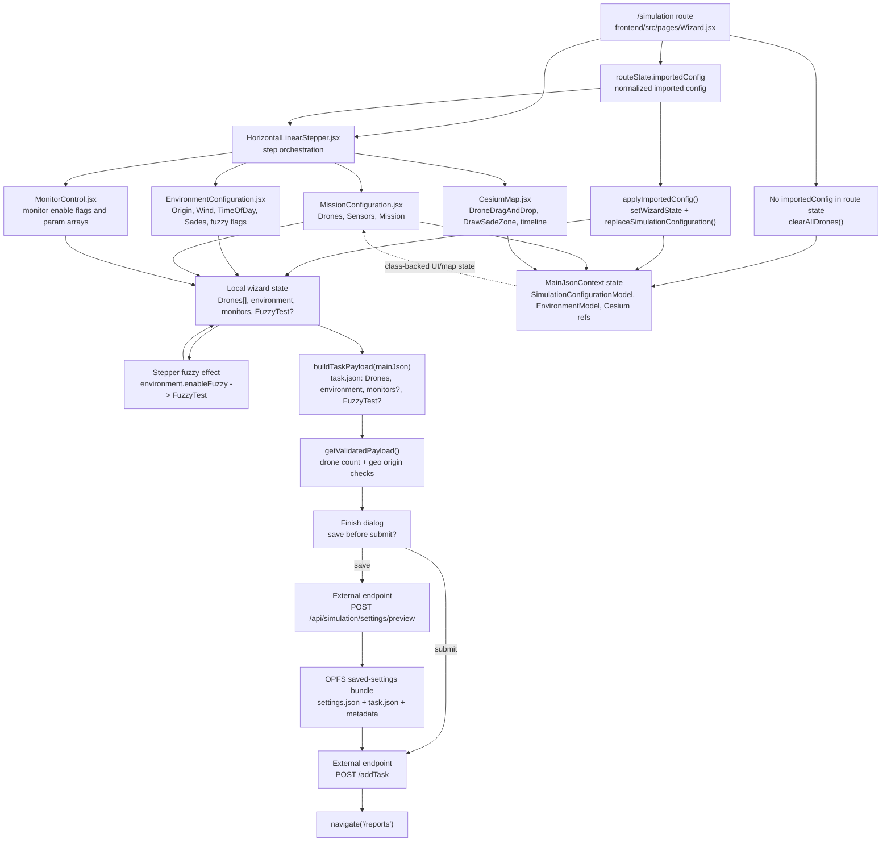
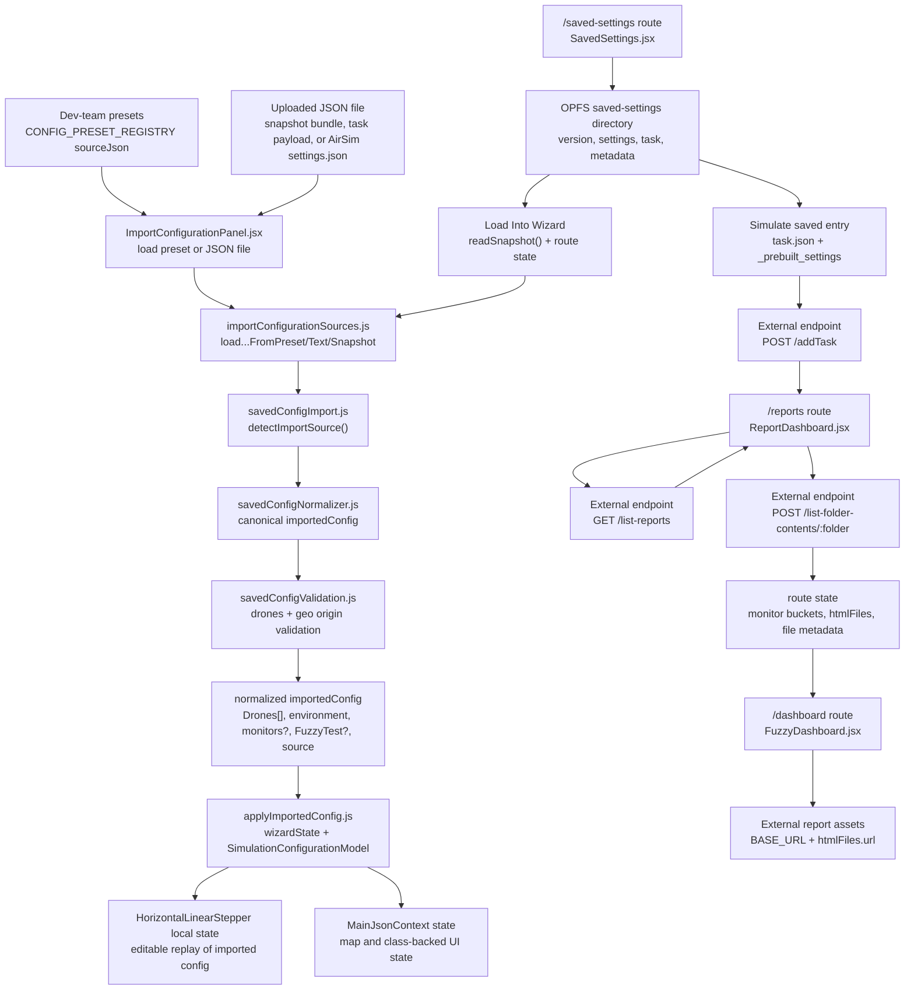

# Frontend Data Flow

This page maps how runtime data moves through the React frontend. It complements the
high-level architecture diagram in the README by focusing on wizard state, import
normalization, browser-private saved settings, and report navigation.

## How to read these diagrams

- Rectangles are frontend routes, components, utilities, or browser storage.
- Nodes labeled "local wizard state" are plain JavaScript objects owned by
  `frontend/src/components/HorizontalLinearStepper.jsx`.
- Nodes labeled "MainJsonContext" are class-backed context models from
  `frontend/src/contexts/MainJsonContext.js`.
- Backend calls are shown only as external endpoints. Backend internals are out
  of scope for this page.
- `settings.json` means AirSim-compatible settings returned by the backend
  preview endpoint. `task.json` means the frontend submission payload built by
  `frontend/src/utils/taskPayload.js`.

## Wizard configuration and submission flow

The confusing part for new contributors is that the frontend has two state
tracks with similar names. `HorizontalLinearStepper.jsx` owns a plain local
object used for `buildTaskPayload()`. `MainJsonContext.js` owns class-backed
models used by mission editing and Cesium interactions. Importing a config
updates both tracks through `applyImportedConfig()`.

Environment fields start in `frontend/src/components/EnvironmentConfiguration.jsx`
and flow into local wizard `environment`. Mission fields start in
`frontend/src/components/Configuration/MissionConfiguration.jsx` and flow into
local wizard `Drones`. Monitor settings start in
`frontend/src/components/MonitorControl.jsx` and flow into local wizard
`monitors`; fuzzy selections also update `environment.enableFuzzy`, which the
stepper converts into `FuzzyTest`.

Cesium interactions in `frontend/src/components/cesium/CesiumMap.jsx` update
`MainJsonContext` through child components such as `DroneDragAndDrop` and
`DrawSadeZone`. The submission payload is assembled from the stepper's local
state, so contributors changing map-driven fields should verify whether the
plain wizard state also receives the intended value. This caution is currently
inferred from code.

The submit boundary is `buildTaskPayload(mainJson)` in
`frontend/src/utils/taskPayload.js`. It normalizes the payload shape, including
wind `Force` to `Velocity` compatibility, strips sensor UI keys, and emits:

- `Drones[]`: drone metadata, sensor settings, and `Mission`.
- `environment`: `UseGeo`, `Origin`, `Wind`, `TimeOfDay`, and `Sades`.
- `monitors`: enabled monitor configs and their `param` arrays, when present.
- `FuzzyTest`: optional fuzzy-test descriptor, when present.

## Saved settings, import, and report flow

Saved settings are browser-private snapshots managed by
`frontend/src/services/savedSettingsStorage.js`. New snapshots are written as a
bundle containing generated `settings.json`, the matching `task.json`, and
metadata used by `frontend/src/pages/SavedSettings.jsx`. Legacy settings-only
entries are normalized at read time where possible.

All import sources converge through `frontend/src/services/configImport/*`.
Presets, uploaded files, and saved snapshots are first detected as one of these
effective shapes:

- snapshot bundle: `{ settings, task?, metadata? }`
- task payload: `{ Drones, environment, monitors?, FuzzyTest? }`
- AirSim settings file: `{ SettingsVersion, Vehicles, OriginGeopoint?, ... }`
- preset wrapper: registry metadata plus one of the supported source shapes

The normalizer converts each supported source into the same editable wizard
shape before `applyImportedConfig()` updates both state tracks. Saved settings
can also bypass editing: `SavedSettings.jsx` can post a saved `task.json` with
`_prebuilt_settings` directly to `POST /addTask`, then navigate to `/reports`.

Reports start after either a fresh wizard submit or a saved replay. `ReportDashboard.jsx`
loads report summaries from `GET /list-reports`; previewing a report calls
`POST /list-folder-contents/:folder` and navigates to `FuzzyDashboard.jsx` with
monitor buckets and file metadata in route state. `FuzzyDashboard.jsx` renders
monitor-specific text, images, fuzzy groups when `file.fuzzy` is true, and links
to interactive HTML files returned by the backend.

## Source files to inspect when changing this flow

- Routes and provider: `frontend/src/App.js`
- Wizard route wrapper: `frontend/src/pages/Wizard.jsx`
- Wizard orchestration and submit logic:
  `frontend/src/components/HorizontalLinearStepper.jsx`
- Class-backed frontend state: `frontend/src/contexts/MainJsonContext.js`
- Submit payload builder: `frontend/src/utils/taskPayload.js`
- Saved settings storage: `frontend/src/services/savedSettingsStorage.js`
- Import detection, normalization, validation, and apply helpers:
  `frontend/src/services/configImport/*`
- Report list and preview routing: `frontend/src/components/ReportDashboard.jsx`
- Detailed report rendering: `frontend/src/components/FuzzyDashboard.jsx`
- Cesium map interaction state: `frontend/src/components/cesium/CesiumMap.jsx`
